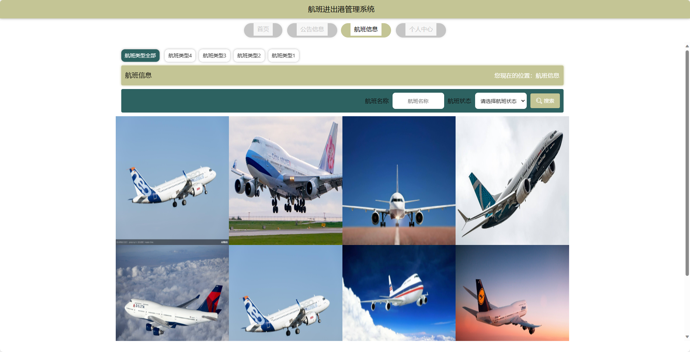
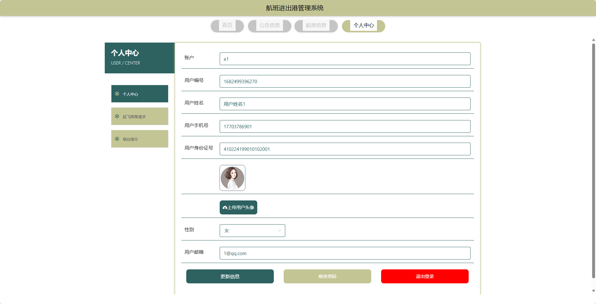
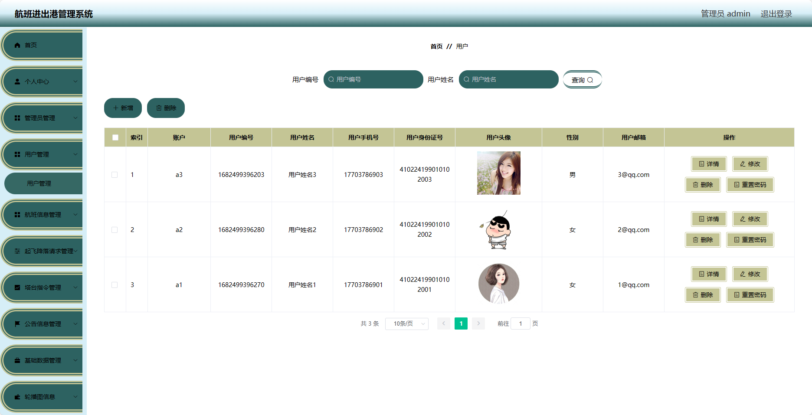
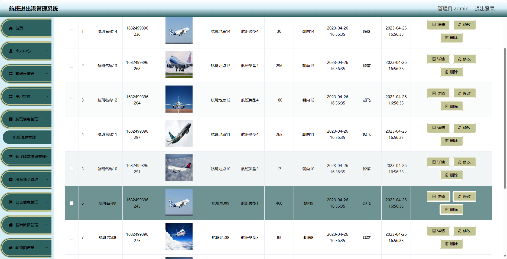
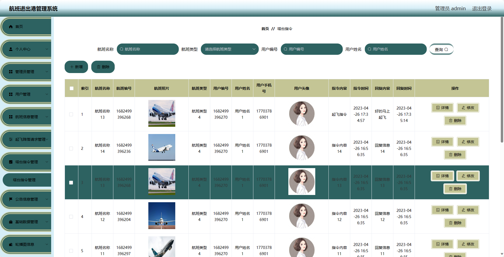
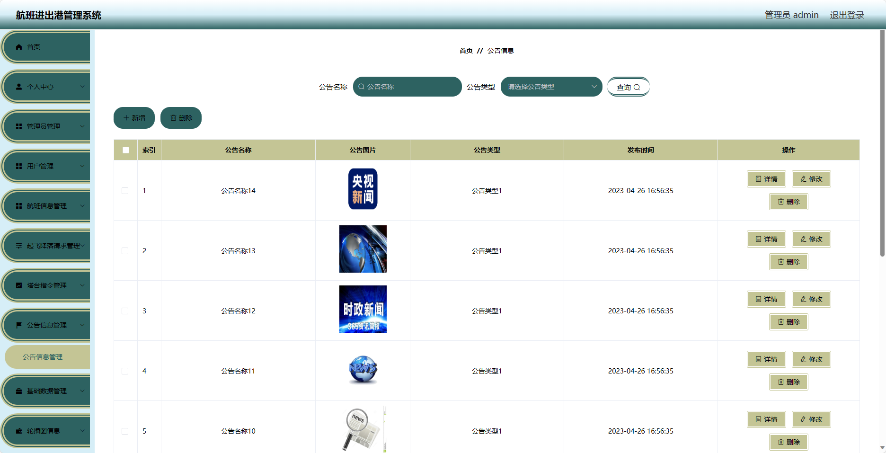

## 基于SpringBoot的航班进出港管理系统(程序+报告)

###  获取sql数据库文件: 从戎源码网 (https://armycodes.com/) QQ: 386869957 QQ群: 377586148
###  所有系统地址: (https://github.com/YuLin-Coder/AllProjectCatalog) 
###  所有项目以及源代码本人均调试运行无问题 可支持远程安装部署调试、定制修改、代码讲解

## 项目介绍
基于SpringBoot的航班进出港管理系统，系统包含两种角色：管理员、用户,系统分为前台和后台两大模块，主要功能如下。

### 【管理员】:
- 个人中心：管理员可以管理个人信息，包括修改密码等操作。
- 管理员管理：管理员可以管理系统的管理员账号，包括添加管理员、编辑管理员、删除管理员等操作。
- 用户管理：管理员可以管理系统的用户账号，包括查看用户信息、禁用用户等操作。
- 航班信息管理：管理员可以管理系统的航班信息，包括添加航班、编辑航班、取消航班等操作。
- 起飞降落请求管理：管理员可以处理用户提交的起飞降落请求。
- 塔台指令管理：管理员可以发布和管理塔台指令信息。
- 公告信息管理：管理员可以发布和管理系统的公告信息。
- 基础数据管理：管理员可以管理系统的基础数据，如航班类型、机场信息等。
- 轮播图信息：管理员可以管理系统首页的轮播图信息。

### 【前台】:
- 首页：展示系统的概览信息和重点推荐内容。
- 公告信息：展示系统发布的重要公告信息。
- 航班信息：提供用户查询航班信息的功能。
- 个人中心：用户可以管理个人信息，包括修改密码等操作。

## 项目技术
- 编程语言：Java
- 数据库：MySQL
- 项目管理工具：Maven
- 前端技术：HTML、CSS、JavaScript、Jquery、Vue
- 后端技术：Spring、SpringMVC、MyBatis

## 运行环境
- JDK版本：JDK1.8及以上
- 开发工具：IDEA、Ecplise、Myecplise都可以
- 数据库: MySQL5.7及以上
- Maven：maven3.0及以上
- Node：14.14.0及以上

## 运行截图

